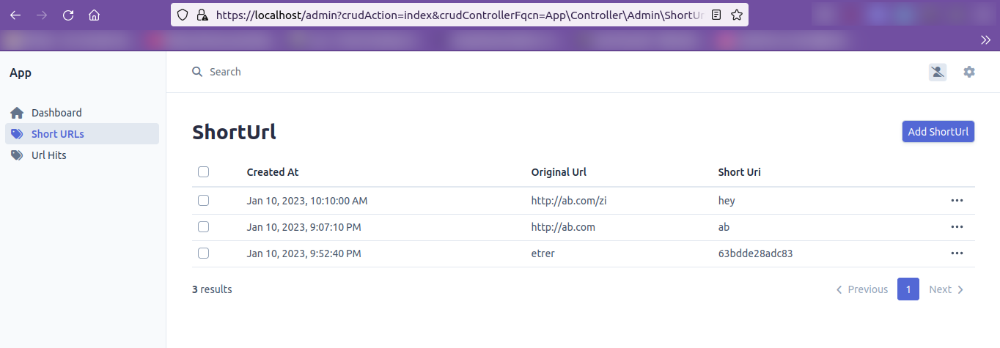
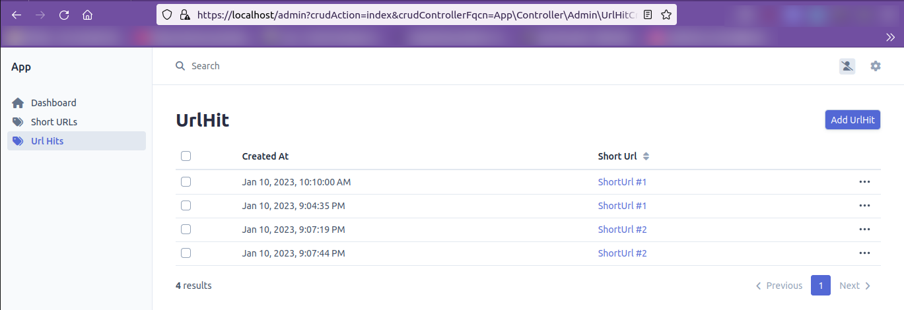

# Symfony URL shortener demo
A sample URL shortener form & service for self-training, leveraging [EasyAdmin](https://github.com/EasyCorp/EasyAdminBundle) and [PHPUnit](https://phpunit.de/).

Relies on [dunglas/symfony-docker](https://github.com/dunglas/symfony-docker) with MySQL added.

## Installing
```
# Ensure you shutdown your webserver / MySQL database if any first (ie. ports 3306 and 80/443).
docker compose build --pull --no-cache
docker compose up
```

## Usage
1. Browse `https://localhost` (and accept the SSL certificate).
1. Browse `https://localhost/admin` and create some Short Url objects (Url Hits object are optional).

   Short Url objects are made up of an automatic creation date, a target URL ("original URL") and slug for redirection ("short URI").

   The latter slug can be left empty for it to be generated automatically.

   Each time the slug is visited (at `/theslug`), a Url Hit object is created and tied to the original shortUrl.

   Note that `/admin` for a slug.. was never tested.
1. Browse `https://localhost/someShortUriYouCreated` to observe redirection.

## Overview



## Running tests
Tests are run in the [Github Actions CI](https://github.com/myselfhimself/sf-url-shortener-demo/actions).
```
make tests-docker
```

Example output:
```
bin/kconsole doctrine:database:drop --force --env=test || true
Dropped database `app_test` for connection named default
bin/kconsole doctrine:database:create --env=test
Created database `app_test` for connection named default
bin/kconsole doctrine:schema:create -n --env=test

 ! [CAUTION] This operation should not be executed in a production environment! 

 Creating database schema...

 [OK] Database schema created successfully!                                     

bin/kphpunit
PHPUnit 9.5.27 by Sebastian Bergmann and contributors.

Testing 
...                                                                 3 / 3 (100%)

Time: 00:00.790, Memory: 24.00 MB

OK (3 tests, 30 assertions)
```

## Known issues
There is no user management and no user signing-in feature in place.

The `/admin` section may collide with a Short URL `admin` short URI value. No check is in place for that.
